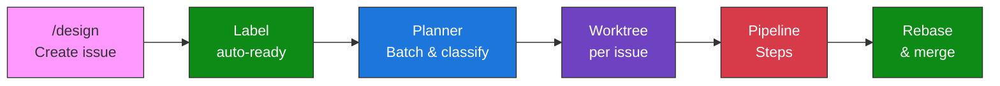
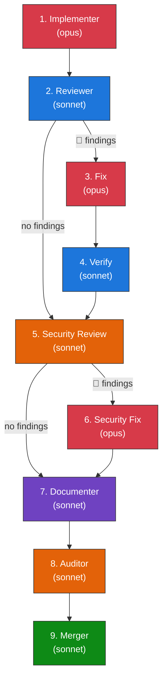
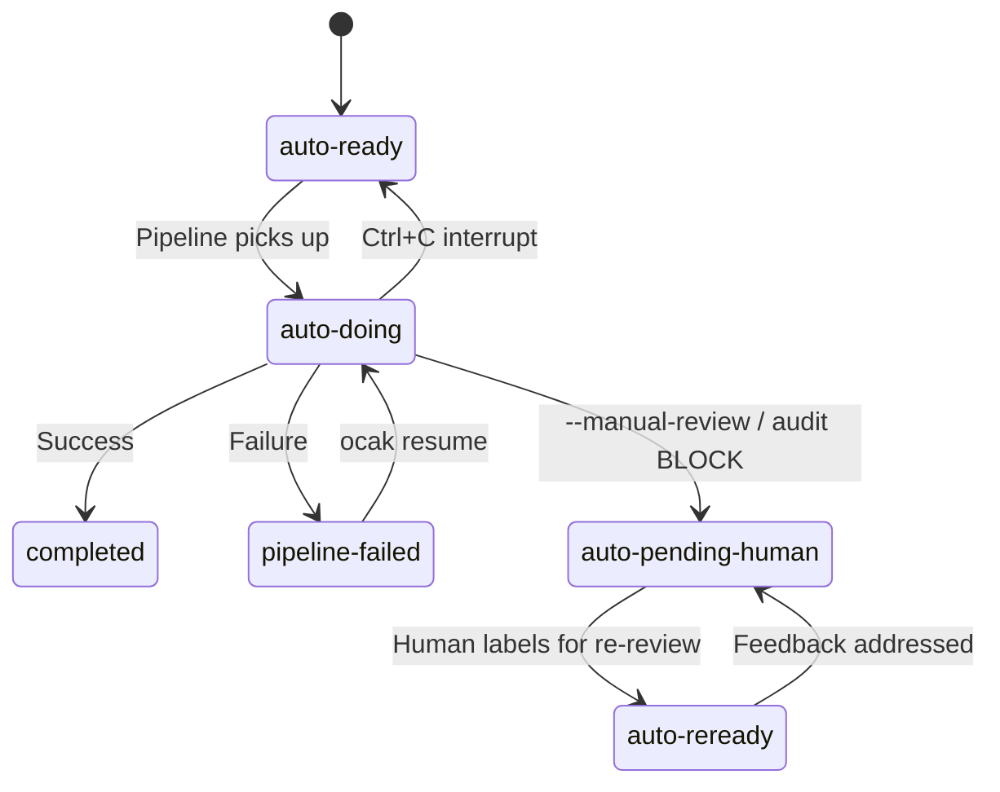
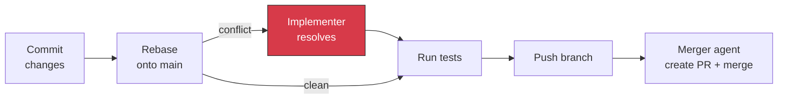
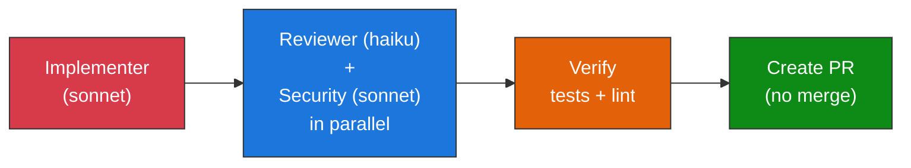

# Ocak

*Ocak (pronounced "oh-JAHK") is Turkish for "forge" or "hearth" — the place where raw material meets fire and becomes something useful. Also: let 'em cook.*

Multi-agent pipeline that processes GitHub issues autonomously with Claude Code. You write an issue, label it, and ocak runs it through implement → review → fix → security review → document → audit → merge. Each issue gets its own worktree so they can run in parallel.

## Quick Start

```bash
gem install ocak

# In your project directory:
ocak init

# Create an issue (interactive):
# Inside Claude Code, run /design

# Process all ready issues:
ocak run --once --watch

# Or run a single issue:
ocak run 42 --watch
```

## How It Works

### Pipeline Flow



### Pipeline Steps



Steps 5-8 are tagged `complexity: full` and get skipped for simple issues. The `--fast` flag forces all issues to simple complexity.

Conditional steps only run when needed:
- **Fix** runs if the reviewer flagged 🔴 blocking issues
- **Verify** runs if fixes were applied
- **Merge** is skipped in `--manual-review` mode or when the auditor returns a BLOCK finding

### Label State Machine



### Complexity Classification

The planner classifies each issue as `simple` or `full`:
- **Simple** — skips security review, second fix pass, documenter, and auditor
- **Full** — runs the complete pipeline

The `--fast` flag forces all issues to `simple`, giving you: implement → review → fix (if needed) → verify (if fixed) → merge.

### Merge Flow

After all pipeline steps complete:



Merging is sequential — one issue at a time — so you don't get conflicts between parallel worktrees.

## Agents

8 agents, each with scoped tool permissions:

| Agent | Role | Tools | Model |
|-------|------|-------|-------|
| **implementer** | Write code and tests | Read, Write, Edit, Bash, Task | opus |
| **reviewer** | Check patterns, tests, quality | Read, Grep, Glob, Bash (read-only) | sonnet |
| **security-reviewer** | OWASP Top 10, auth, injection | Read, Grep, Glob, Bash (read-only) | sonnet |
| **auditor** | Pre-merge security gate | Read, Grep, Glob, Bash (read-only) | sonnet |
| **documenter** | Add missing docs (skips if not needed) | Read, Write, Edit, Bash | sonnet |
| **merger** | Create PR, merge, close issue | Read, Glob, Grep, Bash | sonnet |
| **planner** | Batch issues, classify complexity | Read, Glob, Grep, Bash (read-only) | haiku |
| **pipeline** | Self-contained single-agent mode | All tools | opus |

Review agents (reviewer, security-reviewer, auditor) have no Write/Edit access — they can only read and report.

## Skills

Interactive skills for use inside Claude Code:

| Skill | Description |
|-------|-------------|
| `/design [description]` | Researches your codebase, asks clarifying questions, produces a detailed implementation-ready issue |
| `/audit [scope]` | Codebase sweep — scopes: `security`, `errors`, `patterns`, `tests`, `data`, `dependencies`, or `all` |
| `/scan-file <path>` | Deep single-file analysis with test coverage check, scored 1-10 per method |
| `/debt` | Tech debt tracker with risk scoring (churn, coverage, suppressions, age, blast radius) |

## Modes

### Full Pipeline — `ocak run`

The default. Polls for `auto-ready` issues, plans batches, runs the full step sequence in parallel worktrees, merges sequentially.

```bash
ocak run --once --watch          # Process current batch and exit
ocak run 42 --watch              # Single issue, full pipeline
ocak run --manual-review --watch # Create PRs without auto-merge
ocak run --audit --watch         # Auditor as merge gate
ocak run --fast --watch          # Skip security/docs/audit steps
```

### Fast Mode — `ocak hiz`

Lightweight alternative for quick PRs you'll review yourself:



Runs in your current checkout (no worktree), uses cheaper models, creates a PR without merging. Roughly 5-10x cheaper than the full pipeline.

```bash
ocak hiz 42 --watch
```

### Re-review Flow

When `--manual-review` is enabled, PRs sit open for human review. After leaving feedback, label the PR `auto-reready` and ocak will:

1. Check out the PR branch
2. Run the implementer against the review comments
3. Push with `--force-with-lease`
4. Remove the `auto-reready` label
5. Comment "Feedback addressed. Please re-review."

### Graceful Shutdown

Press `Ctrl+C` once — the current agent step finishes, then the pipeline stops. Work-in-progress is committed with a `wip:` prefix, issue labels reset to `auto-ready`, and resume commands are printed.

Press `Ctrl+C` twice — active subprocesses are killed immediately (SIGTERM → wait → SIGKILL), then the same cleanup runs.

```bash
ocak resume 42 --watch  # Pick up from where it stopped
```

## Configuration

`ocak init` generates `ocak.yml` at your project root:

```yaml
# Auto-detected project stack
stack:
  language: ruby
  framework: rails
  test_command: "bundle exec rspec"
  lint_command: "bundle exec rubocop -A"
  setup_command: "bundle install"
  security_commands:
    - "bundle exec brakeman -q"
    - "bundle exec bundler-audit check"

# Pipeline settings
pipeline:
  max_parallel: 5
  poll_interval: 60
  worktree_dir: ".claude/worktrees"
  log_dir: "logs/pipeline"
  cost_budget: 5.0          # Max USD per issue (kills pipeline if exceeded)
  manual_review: false       # Create PRs without auto-merge
  audit_mode: false          # Run auditor as merge gate

# Safety controls
safety:
  allowed_authors: []        # Restrict to GitHub usernames (empty = current gh user)
  require_comment: false     # Require confirmation comment before processing
  max_issues_per_run: 5      # Cap issues per polling cycle

# GitHub labels
labels:
  ready: "auto-ready"
  in_progress: "auto-doing"
  completed: "completed"
  failed: "pipeline-failed"
  reready: "auto-reready"
  awaiting_review: "auto-pending-human"

# Pipeline steps — add, remove, reorder as you like
steps:
  - agent: implementer
    role: implement
  - agent: reviewer
    role: review
  - agent: implementer
    role: fix
    condition: has_findings
  - agent: reviewer
    role: verify
    condition: had_fixes
  - agent: security-reviewer
    role: security
    complexity: full
  - agent: implementer
    role: fix
    condition: has_findings
    complexity: full
  - agent: documenter
    role: document
    complexity: full
  - agent: auditor
    role: audit
    complexity: full
  - agent: merger
    role: merge

# Override agent files
agents:
  implementer: .claude/agents/implementer.md
  reviewer: .claude/agents/reviewer.md
  # ...
```

## Customization

### Swap Agents

Point any agent at a custom file:

```yaml
agents:
  reviewer: .claude/agents/my-custom-reviewer.md
```

### Change Pipeline Steps

Remove steps you don't need, add your own, reorder them:

```yaml
steps:
  - agent: implementer
    role: implement
  - agent: reviewer
    role: review
  - agent: merger
    role: merge
```

### Add Custom Agents

Create a markdown file with YAML frontmatter:

```markdown
---
name: my-agent
description: Does something specific
tools: Read, Glob, Grep, Bash
model: sonnet
---

# My Custom Agent

[Instructions for the agent...]
```

Then reference it in `ocak.yml`:

```yaml
agents:
  my_agent: .claude/agents/my-agent.md

steps:
  - agent: my_agent
    role: custom_step
```

### Per-Step Model Override

Override the default model for any step:

```yaml
steps:
  - agent: implementer
    role: implement
    model: sonnet    # Use sonnet instead of opus for cheaper runs
```

## Stack Detection

`ocak init` auto-detects your project stack and generates tailored agent templates:

| Language | Frameworks | Test | Lint | Security |
|----------|-----------|------|------|----------|
| Ruby | Rails, Sinatra, Hanami | rspec | rubocop | brakeman, bundler-audit |
| TypeScript/JS | Next, Remix, Nuxt, Svelte, React, Vue, Express | vitest, jest | biome, eslint | npm audit |
| Python | Django, Flask, FastAPI | pytest | ruff, flake8 | bandit, safety |
| Rust | Actix, Axum, Rocket | cargo test | cargo clippy | cargo audit |
| Go | Gin, Echo, Fiber, Chi | go test | golangci-lint | gosec |
| Java | — | gradle test | — | — |
| Elixir | Phoenix | mix test | mix credo | — |

Monorepo detection: npm/pnpm workspaces, Cargo workspaces, Go workspaces, Lerna, and convention-based (`packages/`, `apps/`, `services/`).

## Run Reports

Pipeline runs generate JSON reports in `.ocak/reports/`:

```bash
ocak status --report
```

Shows per-run stats (cost, duration, steps completed, failures) and aggregates across recent runs (avg cost, avg duration, success rate, slowest step, most-skipped step).

## Writing Good Issues

The `/design` skill produces issues formatted for zero-context agents. Think of it as writing a ticket for a contractor who's never seen your codebase. The key sections:

- **Context** — what part of the system, with specific file paths
- **Acceptance Criteria** — "when X, then Y" format, each independently testable
- **Implementation Guide** — exact files to create/modify
- **Patterns to Follow** — references to actual files in the codebase
- **Security Considerations** — auth, validation, data exposure
- **Test Requirements** — specific test cases with file paths
- **Out of Scope** — explicit boundaries to prevent scope creep

## CLI Reference

```
ocak init [--force] [--no-ai]       Set up pipeline in current project
     [--config-only]                Only generate config, hooks, settings
     [--skip-agents]                Skip agent generation
     [--skip-skills]                Skip skill generation

ocak run [ISSUE] [options]           Run the pipeline
     --watch                        Stream agent activity with color
     --dry-run                      Show plan without executing
     --once                         Process current batch and exit
     --fast                         Skip security/docs/audit (simple complexity)
     --max-parallel N               Limit concurrency (default: 5)
     --poll-interval N              Seconds between polls (default: 60)
     --manual-review                Create PRs without auto-merge
     --audit                        Run auditor as post-pipeline gate
     --verbose / --quiet            Control output verbosity

ocak hiz ISSUE [options]             Fast mode: implement + parallel review
     --watch                        Stream agent activity
     --dry-run                      Show plan without executing
     --verbose / --quiet            Control output verbosity

ocak resume ISSUE [options]          Resume from last successful step
     --watch                        Stream agent activity
     --dry-run                      Show which steps would re-run
     --verbose / --quiet            Control output verbosity

ocak status                          Show pipeline state
     --report                       Show run reports (cost, duration, stats)

ocak clean                           Remove stale worktrees
     --logs                         Clean log files, state, and reports
     --all                          Clean worktrees and logs
     --keep N                       Only remove artifacts older than N days

ocak design [DESCRIPTION]            Launch interactive issue design session
ocak audit [SCOPE]                   Print instructions for /audit skill
ocak debt                            Print instructions for /debt skill
```

## FAQ

**How much does it cost?**

Depends on the issue. Simple stuff is $2-5, complex issues can be $10-15. The implementer runs on opus which is the expensive part. Use `ocak hiz` (sonnet-based) for ~5-10x cheaper runs. Set `cost_budget` in config to cap spend per issue. Run `ocak status --report` to see actual costs.

**Is it safe?**

Reasonably. Review agents are read-only (no Write/Edit tools), merging is sequential so you don't get conflicts, and failed pipelines get labeled and logged. External content in prompts is wrapped in XML delimiter tags to prevent prompt injection. Branch names are validated against flag injection. Use `--dry-run` first to see what it would do.

**What if it breaks?**

Issues get labeled `pipeline-failed` with a comment explaining what went wrong. Worktrees get cleaned up automatically. Run `ocak clean` to remove any stragglers, and check `logs/pipeline/` for detailed logs.

**How do I pause it?**

`Ctrl+C` once lets the current step finish, commits WIP changes, resets labels, and prints resume commands. `Ctrl+C` twice kills subprocesses immediately. Exit code 130 either way.

```bash
ocak resume 42 --watch  # pick up from where it stopped
```

## Development

```bash
git clone https://github.com/clayharmon/ocak
cd ocak
bundle install
bundle exec rspec
bundle exec rubocop
```

## Contributing

Bug reports and pull requests welcome on GitHub.

## License

MIT. See [LICENSE.txt](LICENSE.txt).
